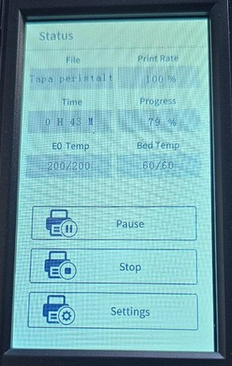

<link rel=”manifest” href=”docs/manifest.webmanifest”>

  

---  

# Control Panel  
The printer comes with a 4.3" touch display which is mounted to the front right edge of the baseframe.  
At the backside of the control unit is a connector where the according cable must be plugged in.  

|  |  |  

At the bottom side of the housing is a microSD card slot, which I guess is supposed to be used for firmware updates of the screen itself (But *not* for updating the regular mainboard's firmware!)   

  

The following picture shows the display's home screen, right after you turned on the printer.  

  

The control panel allows you to control the printer manually.    
You can e.g. initiate the bed leveling process, heat up the extruder, load and unload filament, adjust your z-offset, home one or all axes, chosse the file you want to print and so on.  
The usage is pretty easy and self-explaining, so at this point I won't add pictures of the menu or so.  
See your manual for further information of the possible actions you can take.  
  
It also displays status information like the current temperatures and the temperatures that should be reached due to a certain function or during the printing process as well as error messages if they occur.  

   

In the "About" section you can see further information about the current firmware that's being installed etc.  

  

The "Settings" section shows you the current settings and lets you adjust the z-offset manually.  

  
  

  

---

  

