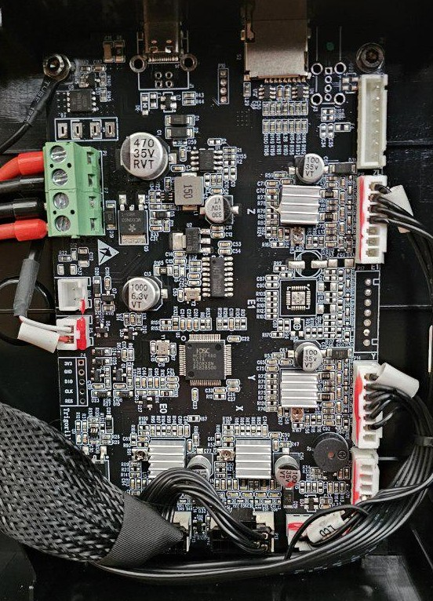
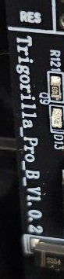
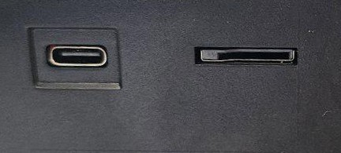
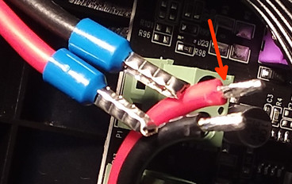
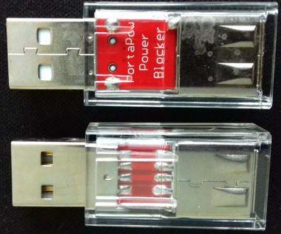
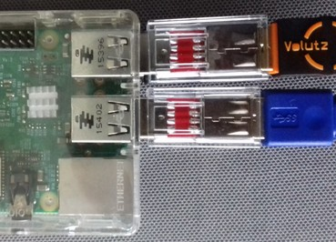
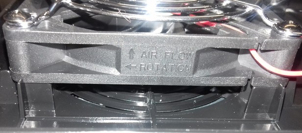
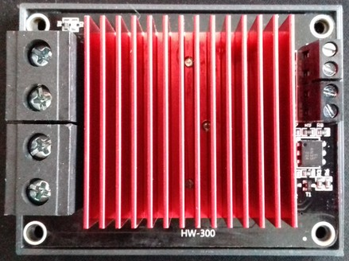
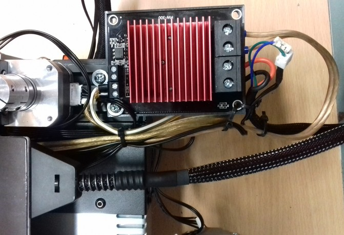

<link rel=”manifest” href=”docs/manifest.webmanifest”>

# Mainboard

---

## TriGorilla Pro B V_1.0.2 (Stock) 
  
The stock mainboard is the "TriGorilla Pro B_1.0.2".  
It is a 32bit 24V mainboard with a Huada HC32F460 KCTA ARM Cortex-M4 with 192KB SRAM and 512KB Flash.  
The speed  of the ARM chip is listed as 200MHz by the manufacturer.  
It offers a microSD card reader, a USB-C connector and a 10 pin connector for adding the control unit.    
The mainboard comes with TMC2208 silent stepper drivers *soldered* onto the board (so they can't be just swapped out!).   

<!--
??? info "Maybe GC6609 Stepper Drivers Are Being Used As Well!"  

    It seems that Anycubic changed the stepper drivers from original TMC2208 to cheap 2208/2209 clones, called "GC6609".  
    When exactly this change took place and whether it's a permanent solution or if only a certain batch of these mainboards have been populated with these kind of stepper drivers is unknown. It seems though that the mainboards which are equipped with these drivers are set up with silver heatsinkns instead of black heatsinks.    
    However, the following picture shows this stepper driver (you'd have to take off the heatsink to identify which specific type was being used at your mainboard - which I wouldn't recommend to do if you're just curious to know which one you have..).    
    
      
    
    I personally don't know anything about these drivers, but @aspiringnobody shared his knowledge and findings in [this discussion](https://github.com/1coderookie/KobraGoNeoInsights/discussions/13). If you know anything more, please reach out and contribute to the discussion!  
    
    Thanks again to @aspiringnobody who came across this and reported it!  
-->  
  
  
  
<!--
    

--> 

  

  

The microSD card reader slot and the USB-C connector can be accessed from at front of the printer, you find them at the right hand side of that black plastic aperture of the frame as shown in the picture below.  

  

---

### Accessing The Mainboard  
If you need to access the mainboard, you need to open the housing where the mainboard is located. For doing so, you need to access the underside of the printer.  
The lid is screwed and clipped into the housing's base, so make sure to be careful when opening.  

<!--
Once you opened the lid, you can see that there's quite a lot of space left inside of the enclosure. If one re-routes the wires, it should be possible to add an [external MOSFET](powersupply.md#add-an-external-mosfet-mod) for the bed here.  

  

Please see the expandable textbox below for further instructions and illustrations about how to actually open the housing and access the PCB.  
 

??? example "How To Open The Mainboard's Housing"  

    - When looking at the underside of the machine, you can see the housing of the mainboard being located it the front, between the outer rails of the baseframe.  
        
    - In the middle you can see two hex screws. These are holding the whole housing in place as they're screwed into the Y-rail in the middle, but they also hold down the lid. So take them out first.  
    - After you took out the screws, you then have to 'unclip' the lid of the housing. As you can see in the following picture, there are plastic 'noses' which rest in the belonging nothes of the housing's base part. Use a thin tool like a screwdriver or a plectrum and insert it in the slot between the housing's lid and the base part.  
      You then need to *carefully* bend the base part slightly away to make the lid come out. I'd suggest to start at one edge like show in the picture below - once you have lifted that up, it's much easier to go around the rest.  
       
    - Once you have released all clips, I'd recommend to unplug the flat ribbon cable of the control unit and lead it through the belonging cutout of the lid for being able to flip the lid over.  
    - Once you have done that, you can flip the lid over as shown in the following picture.  
        
    - Be careful and don't rip off the wire of the fan!    

    **That's it - you successfully opened the housing of the mainboard!**  

    - If you need to take out the whole mainboard now, take out the four screws located in the corners of the mainboard.  
      Then lift up the PCB in the back first, as the USB connectors are positioned in those cutouts in the front of the housing. 
    
    For **reassembling** everything, just follow the steps in reverse.  
    In addition to that, mind the following:  
    
    - Pay attention to the wires though, so that they aren't positioned between the posts where the screws will be screwed through later.    
    - Also mind the black ribbon cable of the control unit - don't forget to lead it through the belonging cutout of the lid and reconnect it to the control unit.  
    - Also make sure to reconnect the black grounding wire at the lower right corner in case you took out the PCB.  

    If you want to **take away the whole housing** to e.g. place it outside an enclosure you put the printer in, mind the following:  
    
    - You have to take off the mount which holds the control unit.  
    - You have to pull out the black plastic cap of the face of the other side's rail. That one is just stuck in the aluminum frame, so you can pull it out. Be careful to not break those little plastic posts though which are shoved into the threads of the middle parts of the 4040 rail.  
        
    - See the following picture for getting an idea of how it should look like when all parts are dismounted for taking away the housing.  
         
    - You now have to disconnect all wires.  
    - Once you have completed this step, you can then just pull out the enclosure. It's shoved in between those two outer rails of the base frame, some plastic noses are guiding it in one of the v-slots.  
        
??? danger "Add Ferrules To The 24V Wires!" 

    **It's highly advisable to cut off the soldered tips of the wires without a plug (power supply and heated bed) and add ferrules to them.**  
    
    When you are screwing down the soldered tip inside the clamp, the solder will get cracked a bit and may get deformed a bit as well. When the wire gets warm due to the current and the solder gets softer, the contact may become loose which could lead to malfunction or even cause fire in the last consequence. So it's always a good idea to just use proper ferrules.     

-->
  
??? danger "Avoid Shortcuts!"  
  
    *Shortcuts coming from the cartridge heater for example can/will damage your mainboard, so be careful to never cause a shortcut somehow!*  
    
    A common misbehaviour is to clean the nozzle with a little brass brush during the print process or while everything is heating up.  
    Also grabbing the heater block to e.g. change the nozzle while everything is heating up and electrical current is flowing is another common mistake.  
    When using pliers to hold the heater block, the tips of the pliers may touch the contacts of the wires at the cartridge heater and you cause a shortcut. As a result you can/will get blown up part at the mainboard, like the melted part "D4" for example as shown in the picture below.     
    
    *So always turn off the whole printer first to avoid a shortcut which will destroy your mainboard!*

??? info "Red Glue Across All Connectors"

    When you look at the mainboard, you'll see some red glue spread across all connectors. That's just for securing the connnection. You can get that stuff off by carefully pulling it off. It works better if you warm up that stuff *a little bit* for making it more flexible, a hair dryer is good for that. It then becomes a bit softer and easier to be pulled off. Don't heat it up too much though as it'll become too soft then!  
    You can also use a thin screwdriver to lift up a part of that stuff and then use some tweezers to grab it.    
    
    However, be *very careful* to  
    
    - not harm the mainboard by slipping off with the screwdriver or tweezer!  
    - not overheat the mainboards of parts of it when heating up that red glue!  
    - not rip off the heatsinks of the stepper drivers!  
      This can happen really quick as they're just glued onto the stepper drivers with some thermal paste and the red glue is usually spread across the fins of the heatsinks as well!  
      So *if* you have to pull off that stuff from those connectors of the motor wiring, then *make sure that you press down the heatsink with your finger when trying to pull that stuff off!*  
  
---

### Connecting To The Printer / Mainboard

You can connect to the printer's mainboard with your computer by using a USB-C cable.  
You need to make sure to  
- use a USB-C cable which has a DATA line (many cables for charging smartphones for example don't have a DATA line and therefore won't work),  
- have the driver for the CH34x USB serial chip installed at your computer and  
- set the baud rate for communication to 115200bps.

??? warning "Use A USB Power Blocker"  

    When connecting the printer to a computer or a Raspberry Pi, it is highly recommended to use an additional USB power blocker.  
    By doing so, you make sure that neither the computer nor the mainboard will draw power through the USB-C connector from the other device. If you don't do so, it can harm your mainboard as well as your computer.  
    
    As it's an fast and easy solution, you can get a device called "USB power blocker" for a few bucks. Attention: make sure to *not* get a "USB *data* blocker" though, it *has* to be a *power* blocker!  
    This device will then be plugged between the USB connector of the computer and the actual USB-C cable. It still allows data to be transferred, but the 5V line isn't existent. The following pictures show such a device and how it's installed.  

      

      

    However, you don't *have* to spend money on this item, as there are other ways to interrupt the 5V power line. For example, you can cut the 5V wire of your USB cable, you can solder a male and a female USB connector onto a little PCB and avoid making the 5V line connection or you can simply use some electric or Kapton tape and cover the belonging pin at the USB connector of the cable like shown in the following picture.  

      

    Keep in mind though that you have to pay attention that you *only* cover the 5V pin and that you have to make sure that the tape is still in place every time you plug in the cable after you unplugged it.  

---

## Mainboard Cooling Fan
  
The following picture shows the fan of the mainboard. It's a 80x80x15mm, 24V, 0.06A type ("HSC BCY8015S24L").  

 

As you can see, the fan is covered with a metal grille to avoid that any wires might get caught.  
The following picture shows the mounting direction of the fan.  

  

---
  
## MOD: Different Mainboard 
It's possible to replace the stock mainboard with a different type of board, like e.g. a board from BigTreeTech (BTT). You just have to pay attention that it uses and provides 24V DC as well, as the PSU and the components like the fans etc. are running on 24V. Depending on the type of the board, you might have to use a different ABL sensor (and most likely a different type of control unit as well though, but I assume you'll run Klipper on it then anyway).  

---
## MOD: Add An External MOSFET  

It's advisable to add an external MOSFET for driving the heated bed (if you like, you can also add one for the heater cartridge as well of course). Even though the MOSFET on the mainboard is sufficient, it's an upgrade worth doing as it not only leads to the fact that the bed will be heated up slightly faster, but it also increases the security of the hole printer.  
The MOSFET of the mainboard doesn't have a heatsink and it *may* caused by overheating due to an excessive amount of current being drawn, especially when using higher bed temperatures. Due to the low clearance between the fan of the moainboard and the ground the printer stands on, the cooling isn't the best as well. When using an enclosure which then heats up as well, cooling gets even worse.  
If the board's MOSTFET dies, you most likely have to get a whole new mainboard then. Even though it's possible to solder a new one onto the board (if you're skilled to do that), additional components might have been harmed.  
To avoid that, it's therefore adviseable to add an external MOSFET which then takes the load - the one on the mainboard only acts as a signal for the external one to switch.  

The 24V DC of the PSU will be connected to the belonging connector of the external MOSFET. The 24V DC line from the heated bed screw terminals will be connected with the belonging connector of the external MOSFET and the 24V DC wires of the heated bed will then be connected to the outlet of the external MOSFET. When the mainboard switches the onboard MOSFET, it will then trigger the external one to switch and lead the current to the heated bed.  
There are a few external MOSFETs on the market, most of them only have a "signal" connector. When using a mainboard with a dedicated 'signal' connector for this, it's then connected to that one. When using a mainboard that doesn't have this 'signal' connector like the one being used at these printers, then it's said to connect the 24V from the bed's connector of the mainboard to that.  

I personally prefer a certain type of MOSFET which also offers a dedicated connector for the 24V line besides the 'signal' connector as shown in the following picture.  

  

The PSU and the wiring of the bedplate are connected to the belonging connectors shown in the following picture: 24V from the PSU belongs to the connector labeled as "Power", the 24V for the wiring of the bedplate belongs to the connector "Hotbed".  

  

The 24V of the bed's connector of the mainboard will then be connected to the belonging connector "Bed" at the MOSFET (positioned next to the connector labeled as "Sig").  

  

If you're using this kind (or a different kind) of MOSFET, you should check if the manufacturer actually added some thermal paste between the MOSFET and the heatsink - it wasn't the case at the ones I got as shown in the picture below, so that actually completely counteracts the whole installation and makes it obsolete.  

!!! warning "Mind The Polarity"  

    Pay attention to the polarity when connecting the components!  

!!! warning "Add An Additional Fuse"

    It is highly recommended to add a suitable fuse to the 24V line, right after the connector of the PSU. If your additional parts like the converter will fail, the fuse will melt - which can save you from burning down your house.  
    
The following picture shows the MOSFET being mounted to the rear left-hand side of the frame. I made an extension wire for the thermistor wires as well. 
  
As an additional benefit, now that it's mounted back there, the problem with the bed's wires being too short isn't given anymore.  

  

---

## MOD: How To Add A Step-Down Converter For Using 12V Fans 

When you want to add components which need a different voltage than the 24VDC the PSU offers, you can do so by using a step-down converter (or a step-up converter if you need a higher voltage than 24VDC). Simply connect the IN of the converter to one of the free 24VDC connectors of the PSU, dial in the voltage you need and then connect the belonging part to the OUT of the converter.  
The following picture shows a typical "LM2596S" type step-down converter which can be used.  

 

However, when you want to use e.g. 12V fans which speeds are usually controlled by PWM of the mainboard, you have to connect them differently. The following drawing shows how to proceed in that case, so that the PWM will still work.  

!!! warning 

    The following circuit diagram about how to connect a step-down converter wasn't tested by me yet. It's assumed that the mainboard controls the PWM of the fans by switching the belonging GND of the connector.  

  

!!! warning "Add An Additional Fuse"

    It is highly recommended to add a suitable fuse to the 24V line, right after the connector of the PSU. If your additional parts like the converter will fail, the fuse will melt - which can save you from burning down your house. 

---

## MOD: Add Additional Fuses To The 24V DC Wiring 

It is highly recommended to add a fuse or a fusebox to each of the 24V lines. Pay attention to choose the correct 'size' of the fuse for the belonging part (ampere rating).  
Doing so can save you from burning down your house if components fail or if the wires somehow overheat and start to burn due to broken strands (which causes a higher resistance) or a shortcut.  

(..need to add pic..)

---

   
