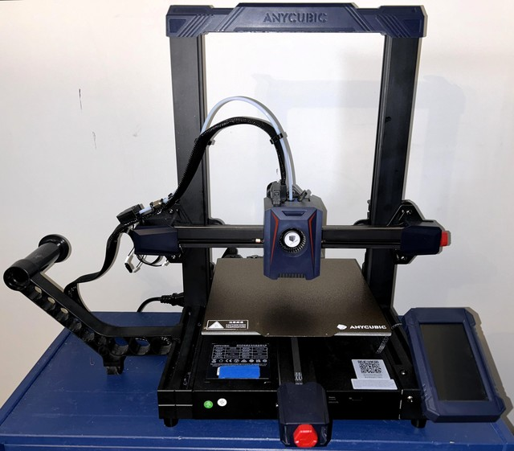
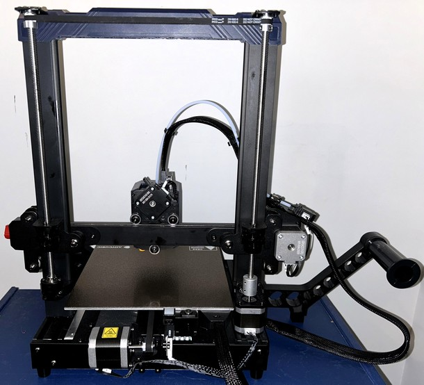

<link rel=”manifest” href=”docs/manifest.webmanifest”>

  

---  

# Printer
The Anycubic [**Kobra 2**](https://store.anycubic.com/products/kobra-2) is a high speed FDM bedslinger style printer.  
It comes pre-assembled, you only have to mount a few parts like the 'upstanding' frame onto the base frame.  

See [Anycubic's support page](https://www.anycubic.com/pages/firmware-software) of the Kobra 2 series to find manuals, firmware, video tutorials and more or use the direct links in the following.  

- [Quick Start Guide v1.2](https://cdn.shopify.com/s/files/1/0245/5519/2380/files/Anycubic_Kobra_2_Quick_Start_Guide_V1.2-EN.pdf?v=1684724241)
- [User manual v1.4](https://cdn.shopify.com/s/files/1/0245/5519/2380/files/Anycubic_Kobra_2_User_Manual_V1.4-EN.pdf?v=1684724252)

The following pictures show the machine.  
  
| Kobra 2 frontview | Kobra 2 backview |  
|:---------------------:|:--------------------:| 
|  |   |  

  

--- 

## Specifications  
  
The following list gives an overview of the most important specifications:    

- Printing dimension: 250 x 220 x 220 mm / 9.8 x 8.7 x 8.7 inches (HxWxD) 
- Printing platform: 220 x 220mm / 8.7 x 8.7 inches (*Attention: the physical dimensions of the bed and the PEI plate are 230x230mm!*) 
- Machine dimensions: 486 x 440 x 4435 mm / 19.1 x 17.3 x 17.1 inches (HxWxD) (plus filament holder mounted to the left side of the base frame) 
- Machine weight: approx. 8.4 kg
- Printing volume: 12.1 l / 3.2 gal
- Aluminum frame  
- X-axis and Y-axis: belt driven (belt tension can be adjusted by knobs), "dual-shaft core" with SG15 bearings/metal rollers (no POM wheels)   
- Z-axis: double threaded rod  
- Printing speed: 300 mm/s (maximum speed), 300mm/s (typical/average speed)
- Control panel: 4.3" LCD touchscreen  
- Mainboard: TriGorilla Pro B V1.0.2, HDSC HC32F460 200MHz Cortex-M4, 32bit, 24V, TMC2208 silent stepper drivers (soldered), USB-C connector, microSD cardreader  
- Extruder / feeder system: direct drive, double gears  
- Heated aluminum bed with a magnetic foil glued onto it, comes with a removable, single side PEI-coated spring steel plate; *physical dimensions: 230x230mm*  
- Hot bed temperature: 110 °C / ≤ 230 °F  
- Automatic leveling: "Anycubic LeviQ2.0" (which is a 25-point bed level measuring process) and "smart Z-offset" 
- Power supply: 400W, 24V DC output, suitable for 110V/230V AC input (set the correct voltage with a switch before using it!)
- Printing material: PLA / ABS / PETG & TPU (optional housing recommended for certain material)  
- Single nozzle in a proprietary Volcano-type hotend, filament diameter 1.75 mm  
- Comes with a proprietary Volcano-like 0.4 mm brass nozzle which is replaceable  
- Nozzle temperature: 260°C / ≤ 500 °F   
- Filament run-out detection sensor  

---

## Box Content

The printer comes partially preassembled and well packed in one big box.  
Since I don't have a picture of the Kobra 2 in a box, let me show you the Kobra 2 Pro instead - the content and spare parts are pretty much the same.  

  
  
Along with the printer come some additional parts, like a sample of PLA, a USB drive, some tools, a spare nozzle and so on. You can see these items in the following picture.  

  

---

  
 
